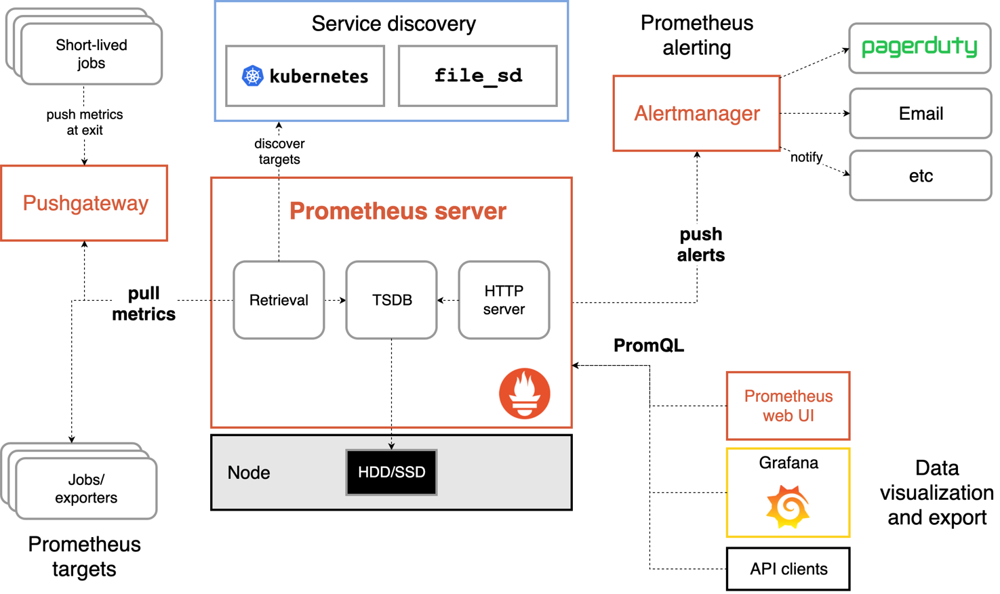

<!-- @import "[TOC]" {cmd="toc" depthFrom=1 depthTo=3 orderedList=false} -->

<!-- code_chunk_output -->

  - [核心组件](#核心组件)
  - [任务和实例](#任务和实例)
  - [时间序列](#时间序列)
  - [PromQL](#promql)
- [Project: Capability Development China](#project-capability-development-china)
  - [Sub-Project: DARK-HORSE](#sub-project-dark-horse)

<!-- /code_chunk_output -->


### 核心组件
Prometheus是一个开源的监控告警系统，它支持按多个维度存储监控数据，配套的PromQL可以对数据进行灵活的查询。
下图为其整体的架构：


主要包含四部分：
- Prometheus Server，Prometheus Server用于从Exporters拉取数据，将采集到的监控数据按照时间序列的方式存储在本地磁盘当中（Prometheus Server本身也是一个时序数据库）;并支持通过PromQL和通过API Client对数据进行查询; 它还负责通过服务发现或者静态配置的方式来识别监控目标。
- Exporters，用于从监控目标采集数据，并先Prometheus Server提供收集数据的端口。是一个广义的概念，只要可以支持Server获取监控数据，就可以称为Exporter。具体分为两类：直接采集：此类Exporter直接内置了对Prometheus监控的支持，如cAdvisor, Kubernetes, Etcd等；间接采集：被监控目标不支持直接采集，需要集成专门的类库，比如Mysql Exporter, Consule Exporter, ASP.NET Core Exporter等。
- PushGateway，Prometheus采用Pull模式采集数据，Server会定期调用Exporter提供的端口；但对于定期运行的Job类应用来说，并不是总能采集到数据，此外也可能受网络的限制，Server无法访问到Exporter，这些情况下，可以使用PushGateway进行数据的中转，由Exporter采用Push模式主动将数据发送到PushGateway，再由Server从PushGateway拉取数据。
- AlertManager，Prometheus Server支持基于PromQL创建告警规则，如果规则满足，会产生一条告警，告警的后续处理流程由AlertManager来处理，它内置支持邮件、Slack等方式，也可以通过WebHook支持更多的自定义方式。

#### 通过Docker容器启动
```
docker run -p 9090:9090 -v ${pwd}\prometheus.yml:/etc/prometheus/prometheus.yml prom/prometheus
```

启动完成后，可以通过http://localhost:9090/graph 访问Prometheus的UI界面，或者通过http://localhost:9090/metrics查看原始数据。

### 任务和实例
prometheus.yml的配置示例：
```
global:
  scrape_interval:     15s
scrape_configs:
  - job_name: 'prometheus'
    static_configs:
      - targets: ['localhost:9090']
  - job_name: 'node'
    static_configs:
      - targets: ['localhost:9100']
```
这段基本的prometheus.yml进行了对任务（job_name）、实例（targets）、抓取间隔(scrape_interval)的配置。
**实例**：暴露监控样本数据的HTTP服务，也就是Exporter的HTTP端口地址；
**任务**: 一组相同采集目的的实例，或者同一个采集进程的多个副本则通过任务来管理。

### 时间序列
Prometheus会将所有采集到的样本数据以时间序列（time-series）的方式保存在内存数据库中，并且定时保存到硬盘上。time-series是按照时间戳和值的序列顺序存放的，称为向量(vector). 每条time-series通过指标名称(metrics name)和一组标签集(labelset)命名。可以将time-series理解为一个以时间为X轴的数字矩阵。
```
  ^
  │   . . . . . . . . . . . . . . . . .   . .   node_cpu{cpu="cpu0",mode="idle"}
  │     . . . . . . . . . . . . . . . . . . .   node_cpu{cpu="cpu0",mode="system"}
  │     . . . . . . . . . .   . . . . . . . .   node_load1{}
  │     . . . . . . . . . . . . . . . .   . .  
  v
    <------------------ time ---------------->
```

#### Sample
矩阵的每一个点称为一个样本（sample），样本由以下三部分组成:
- 指标(metric)：metric name和描述当前样本特征的labelsets;
- 时间戳(timestamp)：一个精确到毫秒的时间戳;
- 样本值(value)：一个float64的浮点型数据，表示当前样本的值。
```
<--------------- metric ---------------------><-timestamp -><-value->
http_request_total{status="200", method="GET"}@1434417560938 => 94355
```

#### Metric
Metric的格式：
```
<metric name>{<label name>=<label value>, ...}
```
其中，一个metric可以包含多个标签(label)，用来从多个维度反映当前样本的特征，通过这些维度，Prometheus可以对样本数据进行过滤、聚合等计算。

#### Metric的类型：
在Prometheus的存储实现上所有的监控样本都是以time-series的形式保存在内存TSDB（时序数据库）中的，而time-series又归属于不同的metric，所以从存储上来讲所有的metric都是相同的，但是在不同的场景下这些metric又有区别。具体分为：
- Counter（计数器）
- Gauge（仪表盘）
- Histogram（直方图）
- Summary（摘要）

##### Counter
Counter计数器的值只增不减（除非系统发生重置），这种metric用途非常广泛，比如可以在应用程序中记录某些事件发生的次数，然后通过使用PromQL内置的一系列函数对数据做进一步的分析，比如计算该事件产生速率随时间的变化。

通过rate()计算5m内的平均增长率：
```
rate(process_cpu_seconds_total[5m])
```
通过topk查询端口访问量前10：
```
topk(10,prometheus_http_requests_total)
```

##### Gauge
与Counter不同，Gauge类型的指标侧重于反应系统的当前状态。因此这类指标的样本数据可增可减。常见指标如node_exporter提供的node_memory_MemFree（主机当前空闲的内容大小）、node_memory_MemAvailable（可用内存大小）等。

直接查看系统的当前状态:
```
go_goroutines
```
通过delta()可以获取样本在一段时间返回内的增减情况:
```
delta(go_goroutines[2h])
```

##### Summary和Histogram
这两类指标主要用于统计和分析样本的分布情况。对于一些量化的指标，一般情况下都会计算其平均值，比如API平均响应时间，但这些统计方式会受长尾问题的影响，比如假设大多数API响应都在500ms之间，只有少部分响应时间需要5s，那么统计平均值后就无法识别这少部分响应特别慢的请求。
为了区分是平均的慢还是长尾的慢，可以按照请求响应的时间范围进行分组，Summary和Histogram都可以用于这类统计。但Histogram会按值所在的范围，统计各范围区间的数量；Summary则会按照中位数来统计。
比如Summary类型的go_gc_duration_seconds:
```
# HELP go_gc_duration_seconds A summary of the pause duration of garbage collection cycles.
# TYPE go_gc_duration_seconds summary
go_gc_duration_seconds{quantile="0"} 3.8753e-05
go_gc_duration_seconds{quantile="0.25"} 7.731e-05
go_gc_duration_seconds{quantile="0.5"} 0.000111513
go_gc_duration_seconds{quantile="0.75"} 0.000220177
go_gc_duration_seconds{quantile="1"} 0.00450966
go_gc_duration_seconds_sum 0.164080505
go_gc_duration_seconds_count 1003
```
从上面的样本可以得知go_gc的总次数为1003次，总耗时0.164080505s，中位数耗时0.000111513s。

### PromQL
PromQL是Prometheus内置的数据查询语言，其提供对时间序列数据丰富的查询、聚合以及逻辑运算能力的支持，常用于数据查询、可视化、告警处理等场景。
#### 查询时间序列
Prometheus通过指标名称（metrics name）以及对应的一组标签（labelset）唯一定义一条时间序列。
当直接使用监控指标名称查询时，可以查询该指标名称下的所有时间序列：
promhttp_metric_handler_requests_total
```
promhttp_metric_handler_requests_total{code="200", instance="host.docker.internal:9090", job="prometheus"} 893
promhttp_metric_handler_requests_total{code="500", instance="host.docker.internal:9090", job="prometheus"} 0
promhttp_metric_handler_requests_total{code="503", instance="host.docker.internal:9090", job="prometheus"} 0
```

##### 标签匹配模式
- 完全匹配，=和!=
```
promhttp_metric_handler_requests_total{code="200"}
promhttp_metric_handler_requests_total{code!="200"}
```
- 正则匹配，=\~和!~
```
promhttp_metric_handler_requests_total{code=~"200|500"}
promhttp_metric_handler_requests_total{code!~"200|500"}
```

#### 范围查询
直接使用监控指标名称查询时，返回值中只包含该时间序列中最新的一个样本值，这样的返回结果也叫**瞬时向量**，对应的表达式称为**瞬时向量表达式**。
如果想查询过去一段时间范围内的样本数据时，则需要使用**区间向量表达式**。通过[]来定义
```
promhttp_metric_handler_requests_total[5m]
```
支持的时间单位有s m h d w y
```
promhttp_metric_handler_requests_total{code="200", instance="host.docker.internal:9090", job="prometheus"}[15s]
1280 @1653186543.159
1281 @1653186548.16
1282 @1653186553.16
```

#### 时间位移操作
瞬时向量表达式或者区间向量表达式都是以当前时间为基准，而通过时间位移操作，可以改变时间基准，如位移到2天前：
```
promhttp_metric_handler_requests_total[15s] offset 2d
```

#### 聚合操作
通过PromQL查询时，如果指标和标签不能唯一确定一条时间序列，则会返回多条满足这些特征维度的结果。而通过聚合操作可以对这些时间序列进行处理，现成一条新的时间序列。
```
sum (求和)
min (最小值)
max (最大值)
avg (平均值)
stddev (标准差)
stdvar (标准方差)
count (计数)
count_values (对value进行计数)
bottomk (后n条时序)
topk (前n条时序)
quantile (分位数)
```
如
```
sum(promhttp_metric_handler_requests_total)
{} 1387
```

```
avg(promhttp_metric_handler_requests_total) by (code)

{code="200"} 1395
{code="500"} 0
{code="503"} 0
```

#### 标量和字符串
除了向量类型，PromQL还支持使用标量(Scalar)和字符串(String), Scalar是浮点类型的数字值，直接使用字符串作为PromQL的表达式，则会直接返回字符串。

#### PromQL 操作符
##### 数学运算
瞬时向量与标量直接可以进行加减乘除、取余、幂运算等数学运算，数学运算符会依次作用于瞬时向量的每个样本值，从而得到一组新的时间序列。

而如果是瞬时向量与瞬时向量之间进行数学运算时，过程会相对复杂一点。 例如，如果我们想根据node_disk_bytes_written和node_disk_bytes_read获取主机磁盘IO的总量，可以使用如下表达式：
```
node_disk_bytes_written + node_disk_bytes_read
```
PromQL会根据这个表达式依次找到与左边向量元素匹配（标签完全一致）的右边向量元素进行运算，如果没找到匹配元素，则直接丢弃。同时新的时间序列将不会包含指标名称。

##### 布尔运算
布尔运算可以根据时间序列中样本的值，对其进行过滤，PrmoQL支持的布尔运算符有：
```
== (相等) 
!= (不相等) 
> (大于)
< (小于)
>= (大于等于)
<= (小于等于)
```
瞬时向量与标量进行布尔运算时，会依次对向量中所有时间序列样本的值进行比较，如果结果为true则保留，否则会丢弃。

##### 使用bool修饰符改变布尔运算符的行为
布尔运算符的默认行为是对时序数据进行过滤。而在其它的情况下我们可能需要的是真正的布尔结果。
比如判断promhttp_metric_handler_requests_total的值是否大于1800，是则返回1，否则返回0，这时可以使用bool修饰符：
```
promhttp_metric_handler_requests_total > bool 1800
```

#### PromQL内置函数
通过内置函数可以对时序数据进行丰富的处理。
##### Increase: 计算Counter指标增长率
Counter类型的监控指标其特点是只增不减，在没有发生重置（如服务器重启，应用重启）的情况下其样本值应该是不断增大的。为了能够更直观的表示样本数据的变化剧烈情况，需要计算样本的增长速率。
increase(v range-vector),参数v是一个区间向量，increase函数获取区间向量中的第一个和最后一个样本并返回其增长量。因此promhttp_metric_handler_requests_total的增长率可以这样计算：
```
increase(promhttp_metric_handler_requests_total[1m]) / 60
```

##### rate/irate
除了上述方法，使用rate函数也可以直接计算增长率：
```
rate(promhttp_metric_handler_requests_total[1m])
```
需要注意的是使用rate或者increase函数去计算样本的平均增长速率，容易陷入“长尾问题”当中，其无法反应在时间窗口内样本数据的突发变化。 例如，对于主机而言在2分钟的时间窗口内，可能在某一个由于访问量或者其它问题导致CPU占用100%的情况，但是通过计算在时间窗口内的平均增长率却无法反应出该问题。
为了解决该问题，PromQL提供了另外一个灵敏度更高的函数irate(v range-vector)。irate同样用于计算区间向量的计算率，但是其反应出的是瞬时增长率。
```
irate(promhttp_metric_handler_requests_total[1m])
```
irate函数是通过区间向量中最后两个样本数据来计算区间向量的增长速率。这种方式可以避免在时间窗口范围内的“长尾问题”，并且体现出更好的灵敏度，通过irate函数绘制的图标能够更好的反应样本数据的瞬时变化状态。

**参考资料**
https://yunlzheng.gitbook.io/prometheus-book/

申请使用2022-2-20 timecard 8H中的4H调休时长
timecardId: TCH-02-25-2022-4614256
subProject: DARK-HORSE

功能测试
  单元测试
优化例子 *
DDD
  架构
  值对象

Docker
K8S

.net core 3.1
TL 负责设计、开发 9人
需求，
内部测试：功能测试，压力测试
jmeter
  性能
  RPS IO MEM
例子：
  序列化，json
ADO.NET
EF,Daper
  区别：
  场景：没打出来
.net内存,开发 框架
  对象没有被使用？
.net core
  IIS
  IOC
  middleware
core MVC
  model binding
    领域层

host 方式
  in process
  out process

DDD
  值对象

微服务
  业务功能
  真正的微服务

k8s docker
  编排，治理

依赖注入
  脑袋中索引
  单例：
  scope：
  transitant

CI CD
  autofac
  trigger? 配置

功能测试
  手工测试
单元测试
  写得不多
  xunit
  理解：
  mock框架，没有用过

lambda, delegate, function, linq, action
  delegate
  lambda
  linq, sql的方式，方法的方式
    数据源

### 
6.29 : cycle count:159
9.14 : cycle count:178

### 8X session
黑马：诊断、提升的框架
  - 发现chaos
  - 有序
  - 其它是手段
Customize for observision，而不是通用
Buy or Build
建模，谈场景，而不是谈功能
模型纸上画出来，去IT可以运营
  - 时标对象 -> 一张纸质表
8x flow 1.0, 源于：财务、审计
  - 满足年审，minimal要求
  - 凭证、合同，所有业务都要满足合同法
  - + 【公司法】
建模，非技术建模，而是业务视角
- 问客户问题
  - 什么时候获得收入（义务），支出（权利）
  - 展开conversion的过程
  - 可以在非正式的场景进行，如meal
  - 就算是形式化的，也可以先教客户建模，通常很容易学会，半小时，起因、地点、结果，时间、地点、人物
建模目的
  - 支撑团队
  - 让客户相信，有能力handle上下文，对其问题感兴趣
提前showcase，提前沟通，避免到时出现问题
Customer是角色，人是实例
给客户做：核心 vs 边缘
- 没有任何考试是基于形式情况划线的，而是理想情况

模型-实现统一
- 实现由建模决定
- 8xflow也是模型驱动的方法
- 降低理解的成本

own自己成长
绑定身份
分U
  - 业务高速增长
  - 副作用：身份*2，U>dev
  - 美好愿景：回归dev
    - 从U head拿出一部分权利：职级，还给twker，panel

## Project: Capability Development China
### Sub-Project: DARK-HORSE
- TimecardId: TCH-02-25-2022-4614256 
  - 8/8
- TimecardId: TCH-03-25-2022-4699083
  - 4/4
- TimecardId: TCH-04-07-2022-4743467
  - 4/4
- TimecardId: TCH-04-14-2022-4767597
  - 4/4
- TimecardId: TCH-04-21-2022-4793947
  - 4/4, 0808
- 6/20-6/26 TCH-06-28-2022-5018564
  - 4/4, 0812
- 7/4-7/10 TCH-07-07-2022-5047567
  - 4/4, 0812
- 7/11-7/17 TCH-07-15-2022-5069478
  - 12/8, 0919
- 7/18-7/24 TCH-07-21-2022-5086415
  - 4/0
- 7/25-7/31 TCH-07-26-2022-5105451
  - 4/0
- 8/1-8/7 TCH-08-05-2022-5132238
  - 4/0
- 8/15-8/21 TCH-08-19-2022-5175876
  - 16/0
- 9/12-9/18 TCH-09-16-2022-5272356
  - 4/0
- 9/12-9/18 TCH-09-16-2022-5272355
  - 8/0


苏开 *
黄立超 *
陈璐 *
曾小幸 *
陈婷钰 *
郑鹏程：业务建模, 架构设计 
卢来金：未完成code
郑秋实：未完成code