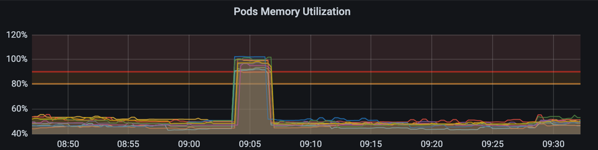
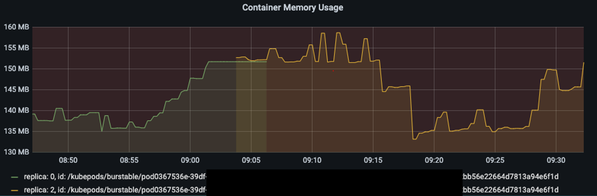
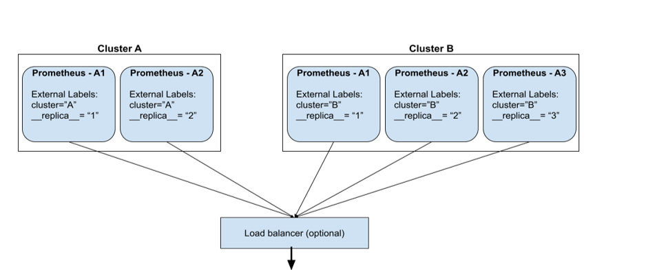
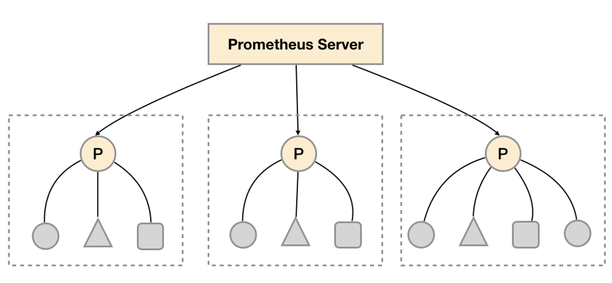
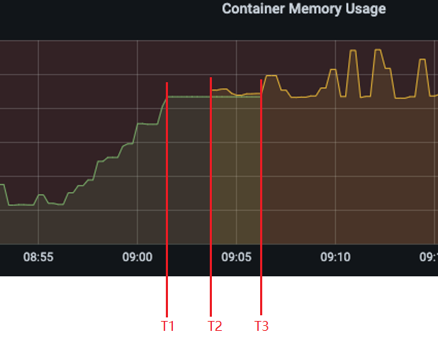

记一次Prometheus监控下的“内存飙升”事件


<!-- @import "[TOC]" {cmd="toc" depthFrom=1 depthTo=3 orderedList=false} -->

<!-- code_chunk_output -->

- [问题描述](#问题描述)
- [尝试定位问题](#尝试定位问题)
- [错误的表达式](#错误的表达式)
- [重叠的时间序列](#重叠的时间序列)
- [Prometheus的高可用机制](#prometheus的高可用机制)
- [联邦集群](#联邦集群)
- [修改PromQL表达式](#修改promql表达式)
- [结语](#结语)

<!-- /code_chunk_output -->

本文将介绍一次在使用Prometheus过程中由于表达式错误引发的问题、以及解决过程。

### 问题描述
项目上的API用Prometheus+Grafana两件套进行监控、告警和可视化，然后大家发现有一个API经常在某段时间突然内存占用飙升，持续约5分钟，之后又恢复正常状态，与此同时CPU占用却出现了突然下降的情况。内存占用见下图：

因为我们设置的告警界限是80%，所以每次出现这种情况，就会触发告警，值周的小伙伴就得查日志、分析请求错误、尝试定位问题原因，但一顿操作猛如虎...，每次都是无疾而终，久而久之，大家已经麻木了，类似的问题只要一出现就直接“朕已阅”（Acknowledged），反正过不了5分钟后，内存占用恢复正常，告警就自己消失了。
直到有一天，项目上一个大佬实在看不下去了，下定决心一定要把问题的元凶给揪出来，没过多久，他成功地找到了问题的原因，容我慢慢道来，没错！我只是个打（水）酱（博）油（客）的。

### 尝试定位问题
首先介绍下API的运行环境：相关的API运行在Docker容器中，然后被Kubernetes托管。此外为了实现调用链的追踪，还集成了一款容器化的追踪工具Jeager，它运行在独立的容器中，但需要与API容器处于同一个Kubernetes的Pod中。
内存飙升可能的原因有哪些呢，内存泄漏？访问量过大导致请求阻塞？程序运行错误？
首先排除内存泄漏，因为内存约5分钟后恢复正常，如果发生内存泄漏，它不会这么快速而自发地释放内存;
那是不是因为访问量过大导致请求阻塞呢，在Grafana显示API内存飙升的时间段，请求量却很平稳，并没有明显的变化；
程序运行错误？也不是，因为查看对应时间段的日志，没有任何错误发生。
奇了怪了，到底是为什么呢，大多数人到这一步就放弃了，毕竟该做的都做了，实在是找不到原因也没办法，但为了找到真相，一定不能在这儿止步。


### 错误的表达式
可能的原因都被一一排除了，还有什么值得怀疑的地方呢，内存占用率是在Grafana用PromQL计算的，有没有可能是这把尺子有问题呢，细细一检查还果真是！
计算内存占用率的表达式是这样的：
```
sum(
    container_memory_working_set_bytes{…} 
    / 
    container_spec_memory_limit_bytes{…} 
) by (pod_name) * 100

```
简单来说就是分两步：
1. 计算容器的内存占有率：内存占用/内存配额
2. 求和，将POD中所有容器的内存占用率相加。

用下图举例：

一个POD包含API容器和Jeager容器，直接叫它们C1 C2容器，假设C1容器的内存占用率为：`80/100*100=80%`,C2容器的内存占用率为：`90/200*100=45%`，那么用上面的表达式计算得出的内存占用率为80%+45%=125%，已经超过了100%，这显然是一个不可能的数字。只是实际情况没有这么极端，从开头第一幅图来看，这个数字是100%左右，给人一种刚刚到极限的感觉。

### 重叠的时间序列
PromQL表达式确实有问题，但怎么会导致内存占用率的计算结果飙升呢？表达式有问题影响的是所有时间段的计算结果，任何时候的内存占用率值都是错误的，还得继续找找飙升的时间段有什么特征。
如果查看单个容器的内存使用量，会发现这个容器的时间序列(Time Serie)非常奇怪，首先一个容器的时间序列应该只有一条才对，但这里出现了两条；而且这两条时间序列发生了重叠，重叠的时间段刚好是内存飙升的时间段。


前面已知错误表达式计算内存占用率的过程，错误的表达式，碰到重叠的时间序列，因为它会将POD中所有容器的内存占用率相加，所以在时间序列发生重叠时，内存占用率会翻倍！这就出现了内存占用率的突然上升，等时间序列不再重叠时，内存占用率看起来又恢复到正常水平。

看来错误的表达式+重叠的时间序列才是导致问题发生的原因。还需要继续查找导致重叠的原因。

### Prometheus的高可用机制
在重叠的图片中，两条时间序列的label中，id是相同，但还有个replica的label，它们的值是不同的。这个不同的replica label实际上来自Prometheus的高可用机制。
Prometheus通常采用pull模式采集数据，Prometheus Server定期从exportor拉取数据，但如果Prometheus Server出故障，数据采集就会中断。为了减少监控系统的故障率，可以构建Prometheus的高可用集群。如下图：

Cluster A和Cluster B分别监控两个不同的服务，但使用了多个Prometheus Server，如Cluster A, Prometheus -A1和Prometheus -A2组成集群同时从一个exportor采集监控数据，这样就算其中一个挂了，监控数据仍然可以被正常采集。这种结构也叫HA Pair。
HA Pair的配置举例：
```
global:
  ...
  external_labels:
    ...
    prometheus_replica: replica-1

scrape_configs:
    ...
    static_configs:
      - targets: ['host.docker.internal:5009']
```
只需在prometheus.yml中增加prometheus_replica: *replica-1/replica-2*这样的配置。
但HA Pair作为集群，自然也少不了一种Leader的选择机制，正常情况下会随机选择一个Server作为Leader，只有Leader采集的数据才会被储存到时序数据库中，如果Leader Server不可用，则会从备份Server中选择一个新的Leader Server。

这就是上图一个容器对应了两条时间序列的原因，一开始使用的是replica_0 的数据，后来发生了leader的切换，便转而使用replica_2 的数据。
切换就切换，但为什么会两条时间序列会重叠呢？这又涉及到另外的机制：联邦集群（Federate）。

### 联邦集群
Prometheus除了可以直接采集被监控目标的数据，还可以组成分层结构，以便于在监控目标太多时实现分组采集，一个Prometheus Server负责一组的采集，最终汇总到顶层的Prometheus Server。
类似这样的结构：

这就是所谓的联邦集群，它的配置举例如下：
```
scrape_configs:
  - job_name: 'federate'
    scrape_interval: 15s
    honor_labels: true
    metrics_path: '/federate'
    static_configs:
      - targets:
        - 'host.docker.internal:9090'
        - 'host.docker.internal:9091'
```
端口9090、9091是两个Prometheus Server的地址，从被监控目标采集数据，这份配置文件启动的Prometheus Server则位于顶层，进一步从9090、9091采集数据，可以看到它有一处比较特殊的配置`metrics_path: '/federate'`，表示从两个子Server采集数据时要访问的地址。
联邦集群可以灵活地适应系统规模的变化，但它也有一个缺点，就是相对与直接采集，数据会有延迟，尤其是在目标挂掉的时候，顶层的Server无法及时地感知到。
在上述情况下，从目标挂掉的那一刻开始，子Server采集的时间序列已经没有新数据进来了，但顶层Server仍然会从子Server继续采集数据，直到5分钟后，如果仍然没有新的数据采集进来，才会认为被监控目标对应的时间序列已中断。

回头再来看前面的两条时间序列，就比较清晰了：

监控系统使用了联邦集群的架构，而且底层的子Server引入了HA Pair以保证高可用，一开始replica_0负责从被监控目标采集数据，对应绿色的曲线，但时间点T1 replica_0由于未知的原因突然挂了，在大约2分钟后，即时间点T2，HA Pair机制选出了新的Leader: replica_2,它开始接替replica_0继续采集数据，对应黄色的曲线。但由于联邦集群的局限，replica_0对应的时间序列并没有立即消失，而是维持了5分钟，直到时间点T3，在这5分钟之间，由于没有采集到新的数据，就一直显示最后一次的结果，于是绿色曲线的最后5分钟是水平的直线。
所以在T2和T3之间两条曲线出现了重叠，刚好计算内存占用率的PromQL表达式错误地进行了相加地操作，导致在重叠的时间段计算结果出现了翻倍，表现出飙升之后又迅速恢复的假象。

### 修改PromQL表达式
知道了问题出现的来龙去脉后，开始尝试修复问题，曲线重叠是HA Pair和联邦集群的机制共同导致的结果，我们无法干预，于是从PromQL表达式入手。
1. 修改为计算POD的内存占用，因为根据pod_name聚合后，就自动消除了replica label造成的差异:
```
sum(container_memory_working_set_bytes{…} by (pod_name)) 
  / 
sum(container_spec_memory_limit_bytes{…}  by (pod_name))
* 100
```
2. 使用max聚合函数，找到内存占用最大的容器，也可以达到去重的效果，但这样做的前提是Pod中只有一个容器，或者我们关心的这个容器的内存占用一直大于其它容器。
```
max(
  container_memory_working_set_bytes{…} 
  / 
  container_spec_memory_limit_bytes{…} 
) by (pod_name) * 100

```

### 结语
“错误的表达式+重叠的时间序列”共同造成了内存飙升的假象，为了找出时间序列重叠的原因，我们了解到了Prometheus的联邦集群、高可用机制，以及这些特性的局限和特点；而针对错误的表达式的修改，则需要兼顾去除重叠时间序列的影响，为此可以通过合理使用PromQL的sum/max聚合函数来达到去重的目的。

#### 参考资料
- https://prometheus.io/docs/prometheus/latest/federation/#federation
- https://github.com/timescale/promscale/blob/master/docs/high-availability/prometheus-HA.md